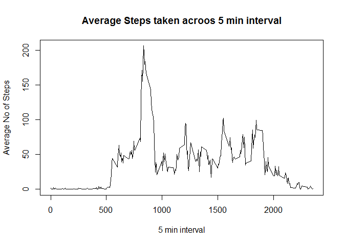
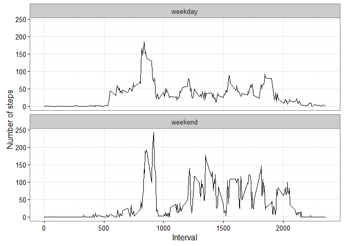

# Reproducible Research: Peer Assessment 1

**Set up working directory for chunk code**


```r
knitr::opts_chunk$set(root.dir = '~/Coursera/5. Reproducible research/Week 2')
```

**Load required libraries**


```r
library(dplyr)
library(ggplot2)
library(Hmisc)
library(psych)
library(lubridate)
```

## Loading and preprocessing the data

1.Load the data (i.e. read.csv())


```r
# Unzip the file

unzip("repdata%2Fdata%2Factivity.zip")

# Read the data 

activity <- read.csv("activity.csv", header = T, stringsAsFactors = F, 
                  na.strings = c("",NA))
```

2.Process/transform the data (if necessary) into a format suitable for your analysis  
  
Look at the structure of dataset


```r
str(activity)
```

```
## 'data.frame':	17568 obs. of  3 variables:
##  $ steps   : int  NA NA NA NA NA NA NA NA NA NA ...
##  $ date    : chr  "2012-10-01" "2012-10-01" "2012-10-01" "2012-10-01" ...
##  $ interval: int  0 5 10 15 20 25 30 35 40 45 ...
```

* steps variable is the Number of steps taken in a 5-minute interval which is a count and data type of this variable is integer which is obvious.    
 
* date variable is read as character variable which has to be transformed to date format.  


```r
activity$date <- as.Date(activity$date, format = "%Y-%m-%d")
```

* interval variable is read as an integer, as this variable is an identifier it can be either character or integer type. 


## What is mean total number of steps taken per day?

1.Calculate the total number of steps taken per day


```r
Steps_per_day <- activity %>% 
        group_by(date) %>% summarise(stepsPerDay = sum(steps,na.rm = TRUE))
```

2.Make a histogram of the total number of steps taken each day


```r
hist(Steps_per_day$stepsPerDay, main = "Histogram of the total number of steps taken each day", 
     xlab = "stepsPerDay", col = "red", breaks = 20)
```

<!-- -->

3.Calculate and report the mean and median of the total number of steps taken per day


```r
MeanstepsPerDay <- round(mean(Steps_per_day$stepsPerDay, na.rm = TRUE),2)

MedianstepsPerDay <- round(median(Steps_per_day$stepsPerDay, na.rm = TRUE),2)
```

* Mean total number of steps per day is : 9354.23  

* Median total number of steps per day is:  1.0395\times 10^{4}  

## What is the average daily activity pattern?

1.Make a time series plot (i.e. type = "l") of the 5-minute interval (x-axis) and the average number of steps taken, averaged across all days (y-axis)


```r
AvgStepsPerInterval <- activity %>% 
        group_by(interval) %>% summarise(Avgsteps = round(mean(steps,
                                                              na.rm = TRUE),2))

# Using base plot

plot(AvgStepsPerInterval$interval ,AvgStepsPerInterval$Avgsteps,type ="l",
     main = "Average Steps taken acroos 5 min interval",
     xlab = "5 min interval",
     ylab = "Average No of Steps")
```

<!-- -->

2.Which 5-minute interval, on average across all the days in the dataset, contains the maximum number of steps?


```r
max_interval <- AvgStepsPerInterval$interval[which.max(AvgStepsPerInterval$Avgsteps)]
```

* Most Steps at: 835

## Imputing missing values

1.Calculate and report the total number of missing values in the dataset (i.e. the total number of rows with NAs)


```r
missingCount <- length(which(is.na(activity)))
```

Total number of missing values in the dataset 2304  

2.Devise a strategy for filling in all of the missing values in the dataset. The strategy does not need to be sophisticated. For example, you could use the mean/median for that day, or the mean for that 5-minute interval, etc.  


```r
skewness <- skew(activity$steps, na.rm = TRUE)

kurtosis <- kurtosi(activity$steps, na.rm = TRUE)
```

steps variable in activity dataset has 4.1710675 skewness and 
18.4316051 kurtosis.  

So imputation with median will be an optimal solution, rather than doing same imputation for all the time intervals, it's better solution to impute median by interval.   

3.Create a new dataset that is equal to the original dataset but with the missing data filled in.


```r
activity$steps <- impute(activity$steps, fun = median, by = activity$interval)
```

**steps variable in activity dataset is imputed with median.**

4.Make a histogram of the total number of steps taken each day and Calculate and report the mean and median total number of steps taken per day. Do these values differ from the estimates from the first part of the assignment? What is the impact of imputing missing data on the estimates of the total daily number of steps?

**Calculate the total number of steps taken per day for imputed dataset**


```r
Steps_per_day_imp <- activity %>% 
        group_by(date) %>% summarise(stepsPerDay = sum(steps,na.rm = TRUE))
```

**Make a histogram of the total number of steps taken each day for imputed dataset**


```r
hist(Steps_per_day_imp$stepsPerDay, main = "Histogram of the total number of steps taken each day for Imputed dataset", 
     xlab = "stepsPerDay for imputed dataset", col = "red", breaks = 20)
```

<!-- -->

**Calculate and report the mean and median of the total number of steps taken per day for imputed dataset**


```r
imp_MeanStepsPerDay <- round(mean(Steps_per_day_imp$stepsPerDay),2)

imp_MedianStepsPerDay <- round(median(Steps_per_day_imp$stepsPerDay),2)
```

* Mean total number of steps per day for imputed dataset is : 9354.23  
* Median total number of steps per day for imputed dataset is:1.0395\times 10^{4}  

_There is no change in the mean and median values of Number of steps taking in a 5-minute interval_  

_Missing value imputation has no effect on the estimates of the  total daily number of steps_

## Are there differences in activity patterns between weekdays and weekends?

1.Create a new factor variable in the dataset with two levels - "weekday" and "weekend" indicating whether a given date is a weekday or weekend day.


```r
activity$weektype <- ifelse(wday(activity$date,label = T) == "Sat","weekend",
                           "weekday")
```

2.Make a panel plot containing a time series plot (i.e. type = "l") of the 5-minute interval (x-axis) and the average number of steps taken, averaged across all weekday days or weekend days (y-axis). See the README file in the GitHub repository to see an example of what this plot should look like using simulated data.


```r
AvgStepsByWeekType <- activity %>% 
        group_by(interval,weektype) %>% summarise(Avgsteps = round(mean(steps,na.rm = TRUE),2))

# using ggplot

ggplot(AvgStepsByWeekType, aes(x = interval,y = Avgsteps)) + 
        geom_line() + 
        facet_wrap(~ weektype, nrow = 2, ncol = 1) +
        xlab("Interval") + 
        ylab("Number of steps") + 
        theme_bw()
```

<!-- -->
